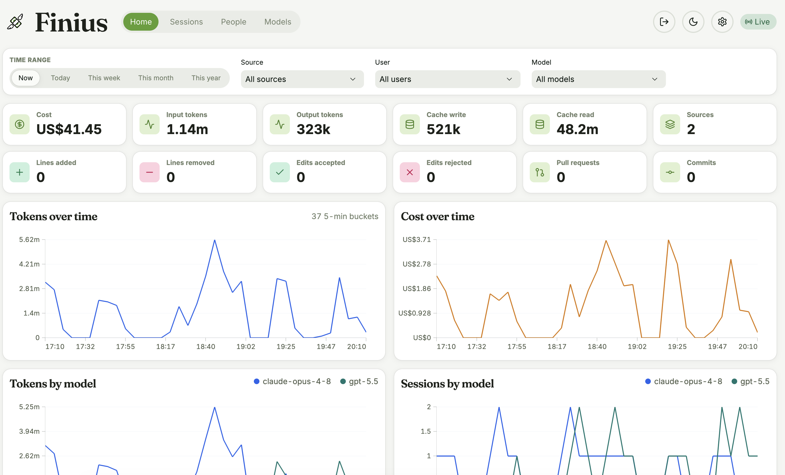

<div align="center">


# Finius

**Local-first usage & cost tracker for Claude Code, Codex, and GitHub Copilot.**

A [Hono](https://hono.dev) server ingests OTLP HTTP/JSON metrics & logs (and JSONL/rollout
transcripts from Claude Code, Codex, and GitHub Copilot — both the `copilot` CLI and VS Code Copilot
Chat) into SQLite; a React + Vite dashboard renders cost, token, session, person, and model
breakdowns with live SSE updates. Everything runs on your machine — no data leaves your laptop
(unless you choose to deploy it on a server for your team!).

[**How Finius compares**](docs/comparison.md) to ccusage, ccflare, the Grafana/OpenObserve OTEL
route, and other Claude Code / Codex / Copilot usage trackers.



</div>

## Quick start (local)

The fastest way to get running locally is the `finius` CLI. You need **Node 22.5+** (Finius uses the
built-in `node:sqlite` module; developed on Node 24).

```bash
npx @cliftonc/finius # first run: installs finius globally, then walks you through setup
finius serve         # start the server + dashboard at http://localhost:8787
finius import all    # optional: import old Claude Code + Codex + Copilot sessions
```

Then launch Claude Code, Codex, or GitHub Copilot in a new terminal and start coding — the dashboard
at **http://localhost:8787** updates live as telemetry arrives.

That's it. Three things just happened:

1. **`npx @cliftonc/finius`** installed `finius` globally and ran `finius setup`, which saved
   `~/.finius/config.json` and — with your consent — edited `~/.claude/settings.json` to add the OTLP
   env vars plus a `SessionEnd` + `PreCompact` hook (`finius hook`) that uploads each session
   transcript. If Codex is installed, setup likewise offers to add its `Stop` hook and OTEL logging to
   `~/.codex/config.toml`. If GitHub Copilot is installed, setup offers to enable VS Code Copilot
   Chat's OpenTelemetry exporter (in VS Code's `settings.json`) and to add the `copilot` CLI's OTLP
   env vars to your shell profile. Copilot reports usage **live over OTLP**, not via a session-end
   hook — unlike Claude Code/Codex there's no transcript-upload hook (Copilot exposes no `SessionEnd`
   equivalent), so token/cost arrive from the live OTLP stream and chat transcripts are picked up only
   when you run `finius import copilot`.
2. **`finius serve`** started a single process exposing the API **and** the dashboard on one port.
   Its data lives under `~/.finius` (override with `FINIUS_DB_PATH` / `FINIUS_BLOB_DIR`).
3. Any Claude Code session you run now reports usage to that local server. If you ran
   `finius import all`, Finius also backfilled historical Claude Code, Codex, and VS Code Copilot Chat
   transcripts already on disk. Use `finius import claude`, `finius import codex`, or
   `finius import copilot` to import only one agent.

Re-run `finius setup` any time to reconfigure, or `finius doctor` to diagnose telemetry that isn't
arriving.

> **Going further?** [`setup/quick-start.md`](setup/quick-start.md) is a step-by-step guide covering the
> local (no-auth) flow above in more detail, **team deployment** on a shared server (real domain + TLS
> termination, choosing auth), and setting up **GitHub OAuth** login gated by org membership.

## Running from source (development)

Prefer to hack on Finius itself? Clone the repo and run the dev servers.

### 1. Install & start

```bash
npm install
npm run dev
```

`npm run dev` runs the API and UI together (via `concurrently`):

- **UI** → http://localhost:5173 (Vite dev server; proxies `/api`, `/otlp`, `/events` to the API)
- **API** → http://localhost:8787

Run them separately if you prefer: `npm run dev:server` (API only) or `npm run dev:client` (UI only).

### 2. Point Claude Code at the server

In the shell where you launch Claude Code, use the bundled helper — it checks the server is up,
exports the OTLP env vars, then runs `claude`:

```bash
./scripts/run-claude.sh                 # forwards any extra args to `claude`
```

Or export the variables manually:

```bash
export CLAUDE_CODE_ENABLE_TELEMETRY=1
export OTEL_METRICS_EXPORTER=otlp
export OTEL_LOGS_EXPORTER=otlp
export OTEL_EXPORTER_OTLP_METRICS_PROTOCOL=http/json
export OTEL_EXPORTER_OTLP_LOGS_PROTOCOL=http/json
export OTEL_EXPORTER_OTLP_METRICS_ENDPOINT=http://localhost:8787/otlp/v1/metrics
export OTEL_EXPORTER_OTLP_LOGS_ENDPOINT=http://localhost:8787/otlp/v1/logs
claude
```

Run a Claude Code session and the dashboard updates live (SSE) as telemetry arrives.

### 3. (Optional) production build

```bash
npm run build   # tsc -> dist + vite build -> dist/client
npm start       # node dist/server/index.js, serves the built UI from dist/client on :8787
```

When a build exists, `npm start` serves the UI and API from the single port http://localhost:8787.

## Using the dashboard

- **Home** — KPIs (cost, tokens, cache, lines, edits, sessions, people), tokens/cost/lines/edits
  charts over time, plus Models / Users / Sources breakdowns.
- **Sessions**, **People**, **Models** — lists ranked by recency / cost. Click any row (or any Home
  breakdown row) to drill into the Home view filtered to that session, person, or model.
- **Filters** — time range, source, user, and model selects apply everywhere. All view and filter
  state lives in the URL query string, so any view is shareable/bookmarkable and back/forward works.

## Importing transcripts

Besides live OTLP telemetry, you can backfill from JSONL transcripts:

- `POST /api/import/jsonl` — body `{ content, source?, sessionId? }` (or raw JSONL text).
- `POST /api/import/claude-hook` — body `{ transcript_path, session_id?, cwd? }`; reads a local
  Claude Code transcript file (restricted to `~/.claude/projects` or the given `cwd`).

Imports are idempotent — re-sending the same file (matched by content hash) is detected and skipped.
The original transcript is stored as a file and can be viewed from the session drill-down
(`GET /api/sessions/:id/transcript`).

## Storage

Data is stored in `data/finius.sqlite` by default. Override with `FINIUS_DB_PATH=/path/to/db.sqlite`.
Override the API port with `PORT`. Imported transcript files live under `<db-dir>/transcripts`
(override with `FINIUS_BLOB_DIR`).

Dashboard reads are served from a pre-aggregated hourly `metric_rollup`; raw `metric_points` keep
the full-resolution data for the live view and drill-downs.

### Raw batch retention

The full OTLP payload of each ingest batch is kept in `raw_batches` only to allow replaying history
into new metric classifications. Control it with:

- `FINIUS_RAW_PAYLOADS=retain` (default) | `off` — `off` keeps only the dedup hash, not the payload.
- `FINIUS_RAW_RETENTION_DAYS=7` (default) — age cutoff used by the prune endpoint below.
- `FINIUS_CRON_TOKEN=<secret>` — enables `POST /api/maintenance/prune-raw-batches`. Without it the
  endpoint is disabled (returns 503). Wire a cron to it:

  ```bash
  curl -fsS -X POST -H "Authorization: Bearer $FINIUS_CRON_TOKEN" \
    http://127.0.0.1:8787/api/maintenance/prune-raw-batches
  ```

## Other commands

```bash
npm test         # vitest run
npm run typecheck # tsc --noEmit (strict)
```
